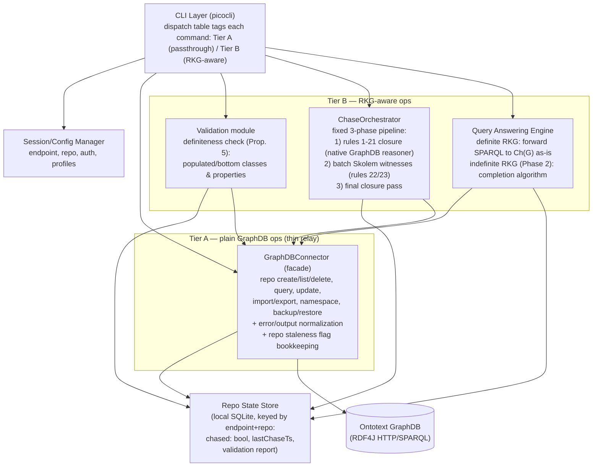

# Software Design Document — RKG Metamodeling Middleware for Ontotext GraphDB

**Status:** Draft — Phase 1 (definite RKGs)
**Related:** [`testing-strategy.md`](./testing-strategy.md) — unit/integration testing approach and the external, black-box benchmarking methodology referenced in §1.3 and §5.4.

---

## 1. Introduction and Overview

### 1.1 Purpose of this document

This document describes the software design of a **command-line middleware** that sits between a user and an Ontotext GraphDB instance, adding support for **RKG Metamodeling Semantics** — a First-Order-Logic-faithful entailment regime for RDFS Knowledge Graphs (RKGs) defined by Delfino, Lenzerini, and Poggi (ECAI 2025), building on Franconi et al.'s logic of extensional RDFS (ISWC 2013). It is intended for the project author and any future contributor or reviewer who needs to understand *why* the system is structured the way it is, not just *what* it does.

### 1.2 Background

Standard RDFS intensional semantics does not capture true set-theoretic extensions, and evaluates SPARQL existential variables through a rigid mapping regime rather than classical FOL: an existential variable must bind to the *same* domain object across all models, whereas classical FOL allows distinct witnesses in different models. RKG Metamodeling Semantics resolves this while fully preserving RDFS metamodeling (an entity can simultaneously be an individual, a class, and a property).

The complication: Ontotext GraphDB, like most commercial Semantic Web engines, is **strictly Datalog-based**. Datalog rule heads cannot introduce fresh existential witnesses (blank nodes) that are not already present in the rule body. Most of the RKG entailment rules (rules 1–21) are safe Datalog and can run natively inside GraphDB. Two rules — **rule 22** and **rule 23** — require minting fresh blank-node witnesses tied to *class*/*property* identity, which GraphDB cannot express. This single fact is the reason a hybrid middleware, rather than a pure GraphDB ruleset, is necessary.

The GraphDB ruleset encoding rules 1–21 (`rules/chase-rules.pie`) is not a user-configurable artifact. It is a **fixed, middleware-bundled ruleset derived directly from the entailment rules formalized by Delfino, Lenzerini, and Poggi (ECAI 2025)** (see Section A.1 of that paper). The middleware ships exactly one ruleset, installs it identically on every repository it creates, and does not expose any mechanism for a user to supply, edit, or substitute an alternative ruleset. This is a deliberate correctness constraint, not an oversight: the soundness/completeness guarantees underpinning the entire system (Propositions 1–5 and Theorem 1 of the paper) are proven with respect to *this specific* rule set. A user-supplied or modified ruleset could silently invalidate those guarantees while still appearing to "work," which is unacceptable for a system whose entire purpose is to faithfully implement a formally specified semantics.

### 1.3 Project objectives and key requirements

1. Allow a user to perform **all core GraphDB operations** through the CLI (repository lifecycle, data import/export, raw SPARQL query/update, backup/restore) without needing a separate GraphDB client.
2. Allow a user to **materialize RKG Metamodeling Semantics** over an RDFS graph they load, i.e. compute `Ch(G)`, the chase closure, so that subsequent SPARQL queries are sound and complete with respect to classical FOL entailment.
3. Programmatically verify whether a graph is a **definite RKG** (a polynomial-time decidable property that is both necessary and sufficient for classical query answering via a canonical model) before committing to the direct-chase path.
4. Evaluate semantic completeness and computational overhead of the custom rule set against GraphDB's built-in reasoning profiles (e.g. `RDFS-Plus`), via **external, black-box benchmarking** of the middleware rather than an in-process benchmarking module (see [`testing-strategy.md`](./testing-strategy.md)).
5. Keep the boundary between "plain GraphDB behavior" and "RKG-specific behavior" explicit in the codebase, so the system never silently reimplements or diverges from GraphDB's own semantics for the operations GraphDB already handles correctly.

### 1.4 Scope

**In scope (Phase 1 — v0.1.0):** definite RKGs only. Full CLI coverage of core GraphDB operations. Definiteness validation. The bounded, non-iterative chase pipeline. Direct query passthrough over the materialized `Ch(G)`. The benchmarking dataset and evaluation approach are addressed separately in [`testing-strategy.md`](./testing-strategy.md), not as a component of the middleware itself.

**Out of scope for Phase 1, planned for Phase 2 — v1.0.0:** general (possibly indefinite) RKGs management.

### 1.5 Document overview

§2 describes the overall system architecture and the two-tier command classification that keeps GraphDB-native behavior separate from RKG-specific logic. §3 covers data design, including the repository state metadata and the shape of RKG triples through the pipeline. §4 covers interfaces — the GraphDB connector API, the chase pipeline's internal contracts, and error handling. §5 details each component's responsibilities and algorithms, most notably the chase orchestrator. §6 describes the CLI as the user interface. §7 lists assumptions, dependencies, and constraints. §8 is a glossary.

---

## 2. System Architecture

### 2.1 Architectural style

The system is a **layered CLI middleware** in front of a single external system (GraphDB), using the **facade pattern** to isolate all GraphDB/RDF4J protocol details behind one connector, and a **pipeline pattern** for the chase computation (closure → witness generation → closure). Commands are explicitly classified into two tiers so the architecture visibly separates "relay" behavior from "semantic" behavior instead of blurring them:

- **Tier A — passthrough commands:** operations that GraphDB already performs correctly and completely (repository admin, raw SPARQL query/update, import/export, namespaces, backup/restore). The middleware acts as a thin relay: normalize input/output/errors, but add no semantic logic.
- **Tier B — RKG-aware commands:** operations that require the middleware's own logic because GraphDB cannot express them natively (definiteness validation, the chase, RKG-aware query answering).

This separation is a deliberate design decision: it keeps the core GraphDB operations honest — Tier A commands are not reinterpreted or filtered — while concentrating all novel, error-prone logic in a small, well-tested Tier B surface.

**One command has a flag-dependent tier, by design:** since answering queries under RKG Metamodeling Semantics is the middleware's core purpose, `rkg query` is **Tier B by default** — it routes through `QueryAnsweringEngine`, requires `chased = true`, and is answered over the full RKG-aware view (default graph plus the reserved witness named graph, reasoning enabled). Passing `--raw` switches the *same command* to Tier A: it bypasses `QueryAnsweringEngine` entirely, routes straight to `GraphDBConnector`, requires no staleness check, and is answered with reasoning disabled and the witness graph excluded — i.e. literal graph-pattern matching against exactly what was explicitly asserted. Every other command in the system keeps one fixed tier; `rkg query`/`--raw` is the sole, intentional exception, chosen so that the semantically "correct by default, raw by explicit opt-out" behavior matches the project's actual value proposition.

### 2.2 High-level architecture diagram



### 2.3 Major components

| Component | Package | Tier | Responsibility |
|---|---|---|---|
| CLI dispatcher | `cli/` | — | Parses commands, routes to the right module |
| Session/Config manager | `config/` | — | Endpoint, repository, credentials, profile resolution |
| GraphDB connector | `connector/` | A | Sole point of contact with RDF4J/GraphDB; error/output normalization; staleness-flag bookkeeping on mutation; embeds and applies the bundled `.pie` ruleset (rules 1–21) atomically as part of repository creation |
| Repo state store | `repostate/` | — | Local embedded store (SQLite), keyed by (endpoint, repo name); tracks `chased`, `lastChaseTimestamp`, last validation report — independent of GraphDB |
| Definiteness validator | `validation/` | B | Polynomial-time populated/bottom check (Prop. 5) |
| Chase orchestrator | `chase/` | B | Fixed 3-phase closure→witness→closure pipeline; Skolem naming |
| Query answering engine | `query/` | B (default) | Default RKG-aware path for `rkg query` (activates unless `--raw` is given): reasoning-enabled query over default graph + witness graph for definite RKGs; completion algorithm for general RKGs (Phase 2) |

### 2.4 Design decisions and trade-offs

- **Why not implement rules 22/23 as a GraphDB stored procedure or SPARQL `INSERT ... WHERE BIND(...)`?** GraphDB's rule engine and SPARQL `BIND` cannot generate a symbol that is guaranteed fresh and stable per class/property identity across runs without external bookkeeping; doing this in Java gives full control over the Skolem naming scheme and keeps the semantics auditable and testable independent of GraphDB's reasoner internals.
- **Why is the `.pie` ruleset fixed and not user-configurable?** Rules 1–21 are not a generic "RDFS-ish" convenience ruleset — they are the exact Datalog-safe subset of the entailment rules formalized by Delfino, Lenzerini, and Poggi (ECAI 2025), and the chase orchestrator's correctness (§5.3) depends on this precise rule set interacting with rules 22/23 in a specific, proven way. Allowing a user-supplied or edited ruleset would decouple the materialized graph from the formal semantics the system claims to implement, silently breaking soundness/completeness without any visible error. The middleware therefore bundles exactly one ruleset, installs it identically on every repository, and exposes no CLI flag or config option to override it.
- **Why a fixed 3-phase pipeline instead of an iterative fixpoint loop?** Analysis (see §5.3) shows rule 22/23 witnesses can never populate a *new* class/property that wasn't already populated by the real data, because population under rules 1–21 depends only on predicate/class identity, not on which specific term (real or witness) satisfies a triple pattern. This means the naive "interleave chase step ↔ GraphDB closure step until fixpoint" design is unnecessary — a bounded pipeline is both correct and cheaper (fewer round trips to GraphDB).
- **Why track repository staleness explicitly rather than re-validating on every query?** Re-running the definiteness check and chase on every query would be correct but wasteful; a small per-repository flag, updated only on mutation, keeps read-heavy workloads fast while still preventing silent use of stale `Ch(G)` after a Tier A mutation (see §3.2).
- **Why keep Tier A as a strict relay instead of adding convenience logic (query rewriting, permission checks) there?** Adding semantic behavior to Tier A would blur the tier boundary and effectively duplicate GraphDB's own responsibilities (and bugs). The only Tier A side effect permitted is the staleness flag update, which is bookkeeping, not semantics.

---

## 3. Data Design

### 3.1 Core data model

The system does not introduce a new data model of its own; it operates directly on RDF triples (RKG triples in the sense of the ECAI 2025 paper: triples over IRIs and blank nodes, possibly with terms playing simultaneous class/property/individual roles). The only middleware-owned data is:

1. **Repository state metadata** (per GraphDB repository) — described in §3.2.
2. **Skolem witness registry** (deterministic, derivable — see §3.3) — not stored separately but reconstructible from the same naming scheme every time.

### 3.2 Repository state metadata

Stored entirely **locally, owned by the middleware**, independent of GraphDB — a single embedded SQLite database file in a per-user config/state directory (e.g. `~/.config/rkg-middleware/state.db`, respecting OS/XDG conventions), in a `repo_state` table. This state is never written into the GraphDB repository itself (e.g. as a reserved named graph): keeping it out of GraphDB avoids polluting the user's data space, avoids collisions with the reserved witness/metadata IRI namespace, and — critically — avoids this bookkeeping being silently swept up by Tier A operations that operate on real data, such as `data export`, `backup`/`restore`, or `data clear`, which must not be able to affect or be affected by the middleware's own state tracking.

The primary key is **(GraphDB endpoint URL, repository name)**, not repository name alone, since a single middleware installation may be configured against multiple GraphDB instances/profiles and repository names are only unique per endpoint.

| Field | Type | Description |
|---|---|---|
| `endpointUrl` | string | GraphDB endpoint this row applies to (part of the composite key) |
| `repoName` | string | GraphDB repository identifier (part of the composite key) |
| `chased` | boolean | Whether `Ch(G)` has been materialized and is up to date |
| `lastChaseTimestamp` | datetime | When the chase pipeline last completed successfully |
| `definite` | boolean \| null | Result of the last definiteness validation (`null` if never run) |
| `indefiniteElements` | list\<IRI\> | Populated only when `definite = false`; the classes/properties that failed the check |

**Data flow:** `connector` sets `chased = false` after any Tier A mutating call (`update`, `import`, `data clear`, direct `INSERT`/`DELETE`), and creates/deletes the corresponding local row on `repo create`/`repo delete` so the local store's lifecycle stays in sync with GraphDB's. `validation` writes `definite`/`indefiniteElements` after each run. `chase` sets `chased = true` and `lastChaseTimestamp` only after all three pipeline phases succeed; a failure anywhere in the pipeline leaves `chased = false`. Because this store is purely local, it remains readable (e.g. for `rkg repo list` to show last-known status) even when the GraphDB server is temporarily unreachable.

**Known limitation:** since this state lives outside GraphDB, it can drift from reality if a repository is modified by another client that bypasses the middleware entirely (e.g. directly through GraphDB Workbench or another SPARQL client). This is a pre-existing limitation regardless of where the metadata is stored — any out-of-band write would bypass the middleware's bookkeeping code path either way — but it is called out explicitly as an assumption in §7.1 rather than left implicit.

### 3.3 Skolem witness naming scheme

Rule 22 witnesses (`sₐ`) and rule 23 witnesses (`s'ₚ`, `s''ₚ`) must be **deterministic** functions of the class/property identity `a`/`p` alone, so that:
- Re-running the chase on an already-chased, unmodified repository is idempotent (no duplicate witnesses).
- Witnesses are reproducible across benchmark runs for comparability.

Naming scheme: `sₐ = <urn:rkg:witness:class:{percent-encode(a)}>`, `s'ₚ = <urn:rkg:witness:prop:src:{percent-encode(p)}>`, `s''ₚ = <urn:rkg:witness:prop:tgt:{percent-encode(p)}>`, where `percent-encode` applies standard IRI percent-encoding to the full IRI of `a`/`p` (for a blank-node class/property, the store's own stable blank-node label is used instead, prefixed with `bn:`, e.g. `<urn:rkg:witness:class:bn:b0>`). Encoding the *full* IRI, not just its local name, avoids collisions between same-named terms from different vocabularies (e.g. two `:Person` classes in different namespaces map to distinct witnesses).

This scheme was chosen over a content hash (e.g. SHA-1) specifically for **readability**: percent-encoding is deterministic and injective just like a hash — guaranteeing idempotent re-chasing and no collisions — but it is also directly decodable by inspection. A user (or `--explain` output) can look at `sₐ` and immediately recover which class it witnesses, without needing a side lookup table; a hash would make this correspondence opaque. The only cost is longer IRIs for deeply-nested namespaces, which has no effect on correctness and can be hidden behind a pretty-printed/decoded form in verbose CLI output. These IRIs are also recognizable (namespace-prefixed) so they can be filtered out of user-facing query results if desired, and so the validator/chase can detect "does a witness already exist for this element" via a simple membership check rather than a full graph scan.

### 3.4 Data validation and integrity rules

- **Definiteness check** (§5.2 for algorithm): every class/property in the graph must be *populated* or *bottom* in `Chⱼ(G)` at the point checked; otherwise the graph (or that element) is *indefinite* and Phase 1's direct-chase path does not apply.
- **Pipeline ordering invariant:** rules 1–21 closure must reach fixpoint *before* rule 22/23 witnesses are computed, because population of a class/property can be indirect (via subclass/subproperty/domain/range propagation) and must be fully known before witnesses are minted (see §5.3).
- **Idempotency invariant:** running the chase pipeline twice on an unmodified, already-chased repository must not add any new triples (guaranteed by the deterministic Skolem naming in §3.3).

### 3.5 Storage and retrieval

All RDF data — raw input, RDFS closure, witnesses, final `Ch(G)` — is stored **inside GraphDB itself**, in the target repository, split across two graphs with a specific, load-bearing purpose (not merely for auditability):

- **Default graph:** raw imported data plus the rules 1–21 RDFS closure GraphDB materializes natively. This is the only graph a `rkg query --raw` call ever sees.
- **`<urn:rkg:witnesses>` (reserved named graph):** exclusively the Skolem witness triples produced by chase Phase 2 (rules 22/23, §5.3). Isolating witnesses in their own named graph is what allows `rkg query --raw` to be answered as genuinely literal graph-pattern matching — a query with no `GRAPH`/`FROM` clause is, by SPARQL default-graph semantics, blind to named graphs, so witnesses never leak into raw results unless a user explicitly queries `<urn:rkg:witnesses>`. The default, RKG-aware `rkg query` path (`QueryAnsweringEngine`, §5.4) explicitly queries the union of both graphs, since witness visibility is required for FOL-correct entailment.

The middleware holds no bulk RDF data in memory or on local disk beyond transient staging during parse/validate steps; repository state metadata (§3.2) is the only persistent middleware-owned state.

---

## 4. Interface Design

### 4.1 Internal interface: `GraphDBConnector`

The sole point of contact with GraphDB, used by every other component (Tier A commands directly, Tier B components internally).

```java
public interface GraphDBConnector {
    void createRepository(String name); // always installs the single bundled ruleset internally; no ruleset parameter is exposed
    void deleteRepository(String name);
    List<String> listRepositories();

    void importData(String repoName, InputStream rdfData, RDFFormat format, String targetGraph);
    void exportData(String repoName, OutputStream out, RDFFormat format, String sourceGraph);

    QueryResult query(String repoName, String sparqlQuery, boolean infer, List<String> namedGraphs);
    // infer=false + namedGraphs=[] (default graph only) implements `rkg query --raw`;
    // QueryAnsweringEngine calls this with infer=true and namedGraphs=["urn:rkg:witnesses"]
    void update(String repoName, String sparqlUpdate);        // INSERT/DELETE (marks repo stale)

    void backup(String repoName, OutputStream out);
    void restore(String repoName, InputStream in);
}
```

All methods throw a single normalized `GraphDBOperationException` carrying: an error category (`CONNECTION`, `MALFORMED_QUERY`, `REPO_NOT_FOUND`, `SERVER_ERROR`), the original GraphDB/RDF4J message, and an HTTP status if applicable. `update`/`importData`/mutating `query` calls trigger `RepoStateStore.markStale(repoName)` as a side effect of the facade, not of the caller.

### 4.2 Internal interface: chase and validation contracts

```java
public interface DefinitenessValidator {
    ValidationReport validate(String repoName); // populated/bottom check, Prop. 5
}

public interface ChaseOrchestrator {
    ChaseResult runChase(String repoName); // requires ValidationReport.isDefinite() == true
}

public interface QueryAnsweringEngine {
    QueryResult query(String repoName, String sparqlQuery); // routes definite vs. general RKG handling
}
```

`ChaseResult` reports triples added per phase (closure count, witness count, final closure count) for observability, surfaced via `--explain` and available to any external benchmarking client as part of the CLI's normal output (see [`testing-strategy.md`](./testing-strategy.md)).

### 4.3 External interface: GraphDB REST + SPARQL protocol

The connector communicates with GraphDB exclusively via its standard **RDF4J HTTP protocol** (repository management REST endpoints) and the **SPARQL 1.1 Protocol** (query/update endpoints), using an RDF4J Java client library rather than hand-rolled HTTP. No GraphDB-proprietary extensions beyond ruleset configuration (which is itself part of GraphDB's repository-config REST API) are used, keeping the connector portable to any RDF4J-compatible triplestore in principle, even though GraphDB is the only supported target for now.

### 4.4 Error handling

- **Tier A errors** (malformed SPARQL, repo not found, connection refused) are caught at the `GraphDBConnector` boundary, normalized, and surfaced to the CLI with a consistent exit code scheme (`1` = user error, `2` = connectivity error, `3` = server error).
- **Tier B errors:** a `validate`/`chase` invocation on an indefinite graph does not throw — it returns a `ValidationReport`/aborts the chase with a clear message listing the offending classes/properties, since this is an expected outcome for Phase 1's scope boundary, not a failure.
- **Staleness errors:** attempting `rkg query` (RKG-aware by default) on a repository with `chased = false` produces a warning-level message directing the user to re-run `rkg chase`, rather than silently answering over an un-chased graph. `rkg query --raw` never performs this check.

### 4.5 Security and authentication

Authentication to GraphDB (basic auth / token, per GraphDB's own configuration) is resolved once by the Session/Config manager per profile and passed through the connector on every call; the middleware itself introduces no additional authentication layer, since it is a single-user local CLI tool, not a multi-tenant service. Credentials are read from a local config file/environment variables, never hardcoded or logged.

---

## 5. Component Design

### 5.1 `GraphDBConnector` (Tier A facade)

- **Purpose:** single relay point for all plain GraphDB behavior, including the literal `rkg query --raw` path (reasoning disabled, default graph only); also the sole writer of the repository staleness flag; owns the bundled `.pie` ruleset resource and applies it at repository-creation time.
- **Input:** CLI-parsed command arguments (repo name, SPARQL strings, file streams, format hints).
- **Output:** normalized `QueryResult`/success status, or a normalized exception.
- **Dependencies:** RDF4J client library; `RepoStateStore`; the bundled ruleset resource (`chase-rules.pie`, packaged with the middleware, e.g. under `src/main/resources/`).
- **Processing logic:** thin pass-through per method; the only non-trivial logic is (a) result-format normalization to the CLI's table/JSON renderer, (b) the staleness-flag update after mutating calls, and (c) on `createRepository`, reading the bundled ruleset resource from the classpath and including it in the same repository-config REST call GraphDB uses to create the repository — a single atomic operation, with no separate "load ontology" step and no way for a caller to substitute a different ruleset.

### 5.2 `DefinitenessValidator` (Tier B)

- **Purpose:** decide, in polynomial time, whether every class and property in the target repository is *definite* (populated or bottom), per Proposition 5 of the ECAI 2025 paper.
- **Input:** repository name (assumes rules 1–21 closure is current, or triggers it first).
- **Output:** `ValidationReport { boolean isDefinite; List<IRI> indefiniteClasses; List<IRI> indefiniteProperties }`.
- **Algorithm:** for every class/property term appearing in the repository, issue a bounded SPARQL `ASK`/`COUNT` to test population (`?x a <term>` / `<term> ?x ?y` non-empty) or "bottomness" (per the paper's definition of a bottom class/property); classify accordingly. Runs once per repository state, gated behind the staleness flag so it is not repeated unnecessarily.
- **Dependencies:** `GraphDBConnector` (read-only queries only).

### 5.3 `ChaseOrchestrator` (Tier B)

- **Purpose:** materialize `Ch(G)`, the RKG chase closure, using a bounded, non-iterative 3-phase pipeline.
- **Input:** repository name; requires `ValidationReport.isDefinite() == true` (Phase 1 precondition).
- **Output:** `ChaseResult` with per-phase triple counts; sets `chased = true` on success.
- **Processing logic:**
  1. **Phase 1 — native RDFS closure.** GraphDB's own reasoner, driven by the middleware's single bundled `.pie` ruleset (rules 1–21, safe Datalog — subclass/subproperty propagation, domain/range typing, and the fixed RDFS meta-axioms, derived directly from Delfino et al. and not user-modifiable), materializes the full closure of the raw input. This is delegated entirely to GraphDB; the middleware issues no per-triple logic here.
  2. **Phase 2 — batch Skolem witness generation (rules 22/23).** One query enumerates every currently populated class (`SELECT DISTINCT ?a WHERE { ?b a ?a }`) and property (`SELECT DISTINCT ?p WHERE { ?a ?p ?b }`). For each without an existing witness (checked via the naming scheme in §3.3), the middleware deterministically derives `sₐ`/`(s'ₚ, s''ₚ)` and adds `⟨sₐ, type, a⟩` / `⟨s'ₚ, p, s''ₚ⟩` to a single batch, inserted via one `INSERT DATA`.
  3. **Phase 3 — final closure pass.** GraphDB re-runs rules 1–21 over the newly added witness triples (e.g. `sₐ type a ⇒ sₐ type Resource` via rule 12/9-family). **This phase provably cannot populate any class/property that was not already populated in Phase 1**, because rule 22/23 preconditions (`⟨b type a⟩`/`⟨a p b⟩`) are satisfied by real data *before* the witness is minted, and any rule 1–21 consequence of the witness triple is already mirrored by the same rule applied to that real underlying triple. This is why **no fixpoint loop is required**: the pipeline is fixed at exactly 3 phases, not an iterate-until-stable loop.
- **Dependencies:** `GraphDBConnector`, `DefinitenessValidator` (precondition check), `RepoStateStore`.

### 5.4 `QueryAnsweringEngine` (Tier B, the default path for `rkg query`)

- **Purpose:** answer SPARQL queries under RKG Metamodeling Semantics; this is the behavior a plain `rkg query` invokes by default (no flag required), since delivering correct RKG semantics is the middleware's core purpose — `rkg query --raw` bypasses this component entirely (see §5.1).
- **Input:** repository name, SPARQL query string.
- **Output:** `QueryResult`, semantically equivalent to evaluating the query against the canonical model `CS(G)`.
- **Processing logic:** if `chased = true` and `definite = true`, call `GraphDBConnector.query(repoName, sparqlQuery, infer=true, namedGraphs=["urn:rkg:witnesses"])` — i.e. reasoning enabled, scoped to the default graph plus the reserved witness graph (§3.5) — since the materialized `Ch(G)` already encodes the canonical-model interpretation, so standard SPARQL evaluation over that combined view is sound and complete (Proposition 2). If `chased = false`, refuse with a staleness warning rather than silently answering over a stale or witness-incomplete graph. General/indefinite RKGs (Phase 2) will instead construct completions `Gφ` over indefinite elements and merge results per Theorem 1 — not implemented in Phase 1.
- **Dependencies:** `GraphDBConnector`, `RepoStateStore`.

---

## 6. User Interface Design

The system's only user interface is a **command-line interface**; there is no GUI. This section documents the CLI's command surface and interaction model.

### 6.1 Command surface

| Command | Tier | Description |
|---|---|---|
| `rkg repo create/list/delete` | A | Repository lifecycle |
| `rkg data import/export/clear` | A | Bulk RDF load/dump |
| `rkg query <sparql> [--file <path>]` | B (default) | Query under RKG Metamodeling Semantics: reasoning enabled, default graph + witness graph, requires `chased = true` |
| `rkg query --raw <sparql> [--file <path>]` | A | Literal passthrough: reasoning disabled (`infer=false`), default graph only, no staleness check |
| `rkg validate` | B | Run the definiteness check, print report |
| `rkg chase` | B | Run the 3-phase chase pipeline |

### 6.2 Query input methods

`rkg query`, in both its default RKG-aware form and its `--raw` form, accepts the SPARQL query/update text through either of two mutually exclusive input methods, resolved by the CLI layer before the string ever reaches `GraphDBConnector`/`QueryAnsweringEngine` — both interfaces still only ever see a plain `String`, so this is purely a CLI-layer concern, not an interface change:

- **Inline argument:** `rkg query --repo people "SELECT ?s WHERE { ?s a :Person }"` — the query text is passed directly as a CLI argument, suited to short, ad hoc queries.
- **File attachment:** `rkg query --repo people --file find-people.sparql` — the CLI reads the full contents of the given `.sparql` (or `.rq`) file as the query text, suited to longer or reusable queries kept under version control.

The CLI validates that exactly one of the inline argument or `--file` is supplied (both together, or neither, is a user error rejected before any GraphDB call is made) and forwards the resulting string uniformly to `GraphDBConnector.query`/`QueryAnsweringEngine.query`. Because file reading is fully resolved at the CLI layer, tier routing (default vs. `--raw`), staleness checks, and result rendering all behave identically regardless of which input method was used.

### 6.3 Representative user workflow

1. `rkg repo create --name people` → Tier A, `GraphDBConnector` creates the repository and applies the middleware's single bundled `.pie` ruleset in the same call (registered but inactive until data triggers reasoning).
2. `rkg data import --file people.ttl` → Tier A, uploads raw triples; `chased` flag stays `false` (fresh repo).
3. `rkg validate --repo people` → Tier B, reports whether the graph is definite.
4. `rkg chase --repo people` → Tier B, runs the 3-phase pipeline; sets `chased = true`; witness triples are written to the reserved `<urn:rkg:witnesses>` named graph, not the default graph.
5. `rkg query --repo people --file find-people.sparql` → Tier B (default), forwards to `QueryAnsweringEngine` since the repo is chased and definite; answered over default graph + `<urn:rkg:witnesses>` with reasoning enabled. Equivalently, `rkg query --repo people "SELECT ..."` runs the same query supplied inline.
6. If the user later runs `rkg data import --file more-data.ttl`, the connector flips `chased = false`, and step 5 would refuse until `rkg chase` is repeated.
7. At any point, `rkg query --raw --repo people "SELECT ?s WHERE { ?s a :Person }"` bypasses all of the above: it queries only the default graph with reasoning disabled, returning literal asserted triples regardless of whether the repo has ever been chased.

### 6.4 Output and feedback conventions


- Tabular results by default; `--json`/`--csv` flags for machine-readable output.
- `--verbose`/`--explain` on `chase` prints per-phase triple counts and timings (surfacing `ChaseResult`).
- Staleness and indefiniteness are surfaced as explicit, actionable warnings (not silent failures), consistent with §4.4.

### 6.5 Accessibility considerations


As a CLI tool, accessibility is addressed by: avoiding reliance on color alone to convey status (paired with text labels like `[OK]`/`[WARN]`/`[ERROR]`); ensuring all output is screen-reader-compatible plain text (no ANSI-art tables that break linearization); supporting `--json` output for consumption by other tools/scripts rather than requiring visual parsing of terminal output.

---

## 7. Assumptions and Dependencies

### 7.1 Technical assumptions

- A running, reachable Ontotext GraphDB instance (local via Docker Compose, per `docker/docker-compose.yml`, or remote) is available and its REST/SPARQL endpoints are network-accessible from the middleware.
- The user's RDF input is well-formed Turtle/RDF (or another RDF4J-supported serialization) prior to import; the middleware validates RKG-specific properties (definiteness) but does not perform general RDF syntax repair.
- Phase 1 assumes the input graph is intended to be a **definite RKG**; indefinite graphs are detected and rejected (with a diagnostic) rather than processed further, until Phase 2 lands.
- Repository state metadata (§3.2) is authoritative only for changes made through the middleware. A repository modified by another client (e.g. GraphDB Workbench, another SPARQL tool) outside the middleware's `GraphDBConnector` will not update the local state store, and the middleware has no way to detect such external changes; the `chased`/`definite` flags may then be stale until the user re-runs `rkg validate`/`rkg chase`.

### 7.2 Dependencies

- **Runtime:** Java (JDK), Gradle build (`build.gradle.kts`).
- **Libraries:** RDF4J client (repository management, SPARQL protocol, RDF parsing via Rio), a CLI framework (e.g. picocli), an embedded SQLite driver (e.g. `org.xerial:sqlite-jdbc`) for the local repository state store, JUnit 5 for testing (already present in `build.gradle.kts`).
- **External service:** Ontotext GraphDB (Docker image, per `docker/docker-compose.yml`), accessed exclusively through its RDF4J-compatible HTTP/SPARQL API — no proprietary GraphDB SDK beyond standard ruleset configuration.
- **Custom ruleset:** [`rules/chase-rules.pie`](../rules/chase-rules.pie), encoding rules 1–21 of the RKG entailment set as a GraphDB Pie ruleset. This file is **bundled with the middleware as a packaged resource, fixed, and not user-configurable**: it is derived directly from the entailment rules formalized by Delfino, Lenzerini, and Poggi (ECAI 2025), and `GraphDBConnector` applies it identically to every repository it creates, in the same call that creates the repository — there is no separate loader component, no CLI option, config file setting, or API to supply an alternative or modified ruleset. Changes to this file are a maintenance concern of the middleware project itself (e.g. tracking corrections or extensions to the formal rule set), not a per-user or per-repository customization point.

### 7.3 Constraints

- GraphDB's Datalog engine cannot generate fresh existential witnesses in rule heads — this is a hard constraint that fixes the boundary between what runs natively in GraphDB (rules 1–21) and what must run in the middleware (rules 22/23), and is the foundational constraint behind the entire hybrid design.
- The `.pie` ruleset is single, fixed, and bundled with the middleware; it is not a per-user or per-repository configuration point. This is a deliberate constraint, not a limitation to be relaxed later: the system's soundness/completeness claims are proven against this specific rule set derived from Delfino et al., and allowing substitution would undermine the guarantee the middleware exists to provide.
- Query entailment for indefinite/general RKGs is NP-complete (Proposition 4); Phase 1 deliberately limits scope to definite RKGs, where a single canonical-model chase suffices and query answering reduces to ordinary SPARQL evaluation.
- The system is designed for single-user, local/trusted-network CLI usage; it is not designed as a multi-tenant network service and has no independent authentication/authorization layer beyond what GraphDB itself provides.

### 7.4 Regulatory/compliance

None identified; this is a research/academic tool operating on user-supplied RDF data with no inherent handling of regulated data categories.

---

## 8. Glossary of Terms

| Term | Definition |
|---|---|
| **RKG (RDFS Knowledge Graph)** | A set of RDF triples interpreted under RDFS metamodeling semantics, where a term may simultaneously act as individual, class, and/or property. |
| **RKG Metamodeling Semantics** | The FOL-faithful entailment regime for RKGs defined by Delfino, Lenzerini, and Poggi (ECAI 2025), correctly interpreting SPARQL conjunctions and existential quantification per classical first-order logic while preserving RDFS metamodeling. |
| **Definite RKG** | An RKG in which every class and property is *definite* (populated or bottom); definiteness is both necessary and sufficient for the graph to admit a canonical model usable for direct query answering (Proposition 1/4). |
| **Indefinite RKG / element** | An RKG (or a specific class/property within it) that is not definite; general query answering over these requires the more expensive completion-based algorithm (Phase 2, NP-complete). |
| **Populated class/property** | A class with at least one known instance, or a property with at least one known triple, in the current chase state `Chⱼ(G)`. |
| **Bottom class/property** | A class/property provably empty in every model of the RKG. |
| **Chase (`Ch(G)`)** | The fixpoint closure of an RKG `G` under the full set of chase rules (1–23); finite and terminating for RKGs since they contain no existential quantifiers of their own. |
| **Canonical model (`CS(G)`)** | The structure directly read off from `Ch(G)`, used as the semantic representative for query answering over definite RKGs. |
| **Skolem witness** | A fresh symbol (`sₐ`, `s'ₚ`, `s''ₚ`) introduced by rules 22/23, deterministically keyed to a class/property's identity, standing in for the existential witness that GraphDB's Datalog engine cannot generate natively. |
| **Rules 1–21** | The "safe" Datalog-expressible subset of the RKG chase rules (standard RDFS entailment: subclass/subproperty propagation, domain/range typing, fixed meta-axioms), derived directly from Delfino et al. (ECAI 2025) and runnable natively by GraphDB via the middleware's single bundled, non-configurable `.pie` ruleset. |
| **Rules 22/23** | The two chase rules requiring fresh blank-node/Skolem witness generation tied to class/property population, which cannot be expressed in GraphDB's Datalog engine and must be computed externally by the middleware. |
| **Tier A command** | A CLI command whose behavior is entirely native GraphDB functionality; the middleware relays it with only error/output normalization and staleness bookkeeping. |
| **Tier B command** | A CLI command implementing RKG-specific logic (validation, chase, RKG-aware query answering) that GraphDB cannot perform on its own. |
| **Staleness flag (`chased`)** | Per-repository metadata indicating whether the materialized `Ch(G)` is up to date with the current raw data; set to `false` by any Tier A mutation, set to `true` only after a successful full chase pipeline run. |
| **RDF4J** | The Java framework/API (used both by GraphDB internally and by this middleware's client) for RDF data manipulation and SPARQL protocol communication. |
| **`.pie` ruleset** | Ontotext GraphDB's proprietary rule-file format, used here to encode rules 1–21. The middleware ships exactly **one** such file ([`rules/chase-rules.pie`](../rules/chase-rules.pie)), derived directly from Delfino et al. (ECAI 2025), installed identically on every repository, and not exposed as a user-configurable option. |
| **Skolemization** | The technique of replacing an existentially quantified variable with a specific function/constant term (here, a deterministic IRI derived from the associated class/property), used to represent rule 22/23 witnesses concretely in the stored graph. |
